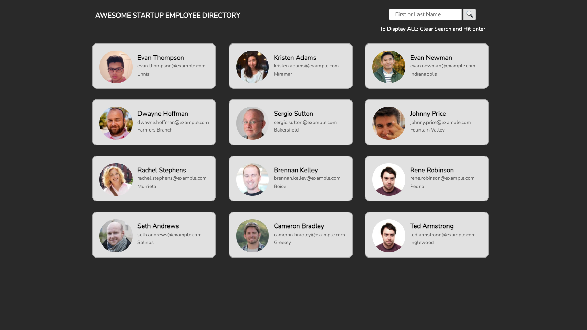
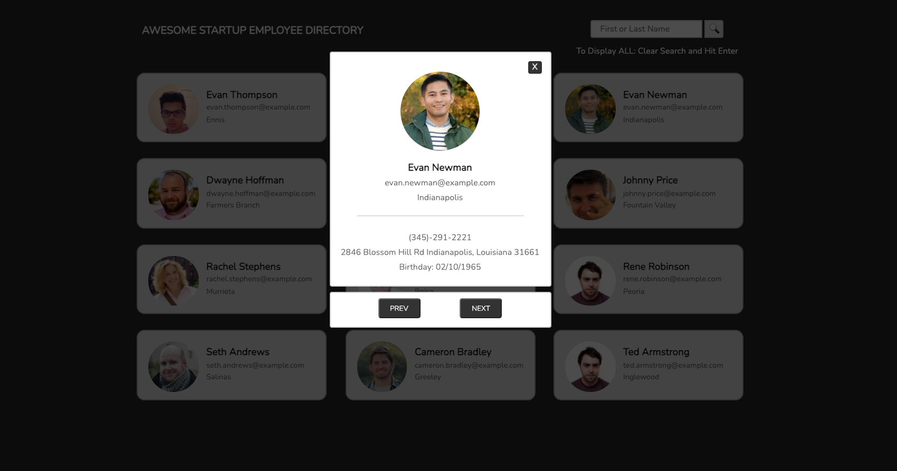

# Full Stack JavaScript Techdegree - Project 5 Public API Requests
"Many sites — Twitter, Facebook, IMDB, and Wikipedia to name a few — offer a vast sea of data that you can access and display on your own web pages. Using JavaScript, [I created] an employee directory by communicating with a third-party API (Application Programming Interface)." (Team Treehouse Project 5 Overview)

## Motivation
This is another stepping stone towards completing the Full-Stack JavaScript program.

## Tech/framework used
<b>Built with</b>
- [VSCode](https://code.visualstudio.com/)

## Installation
1. Index.html file can be opened in any browser.

## License
MIT © [ShelbyGoudy]()
